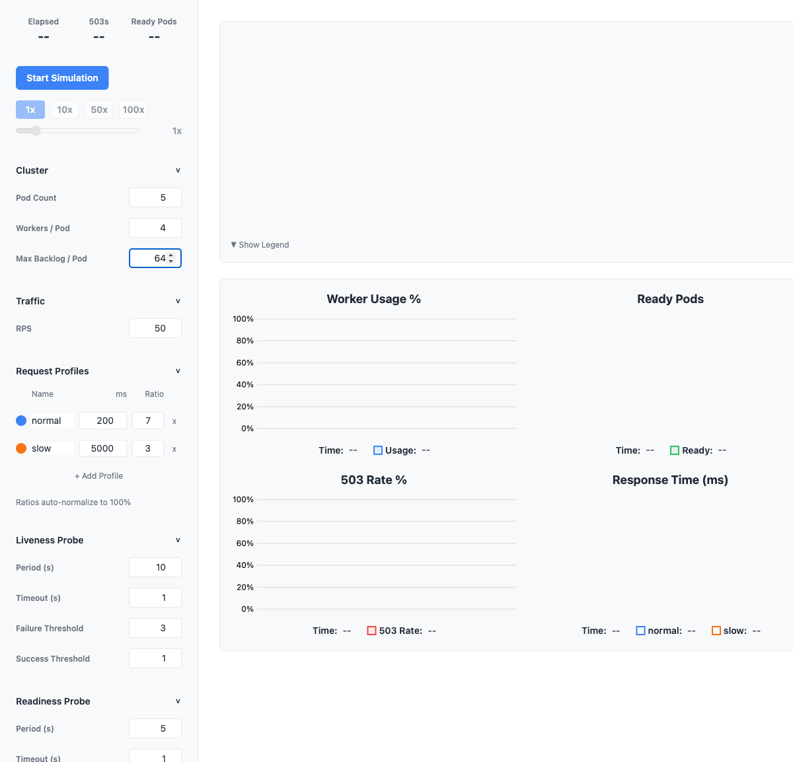
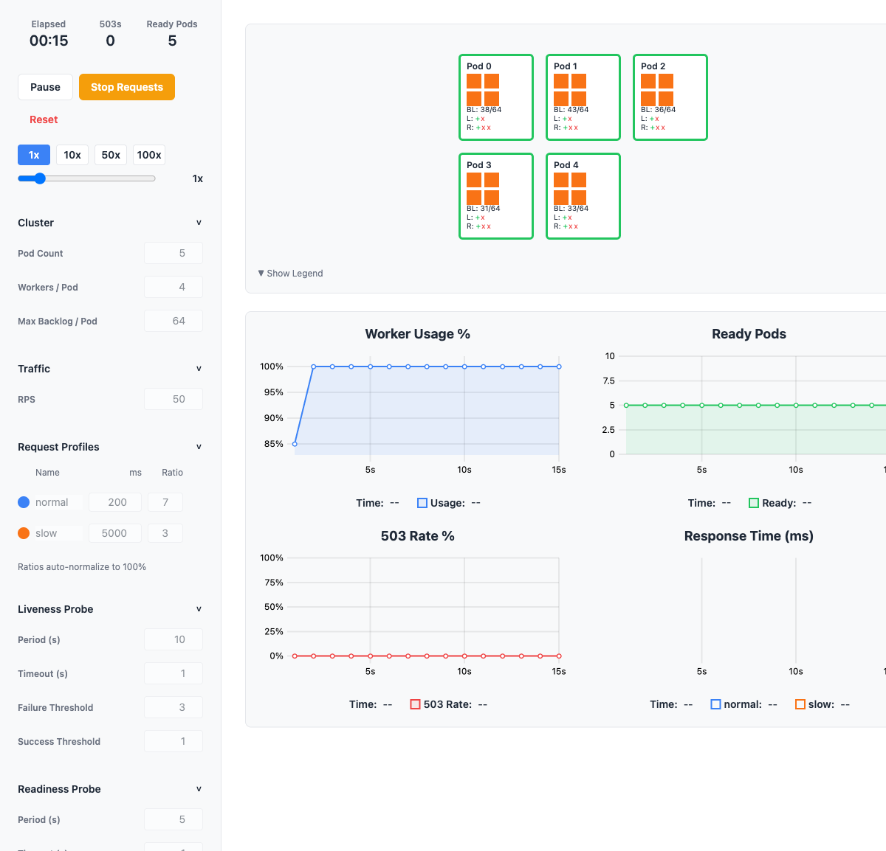
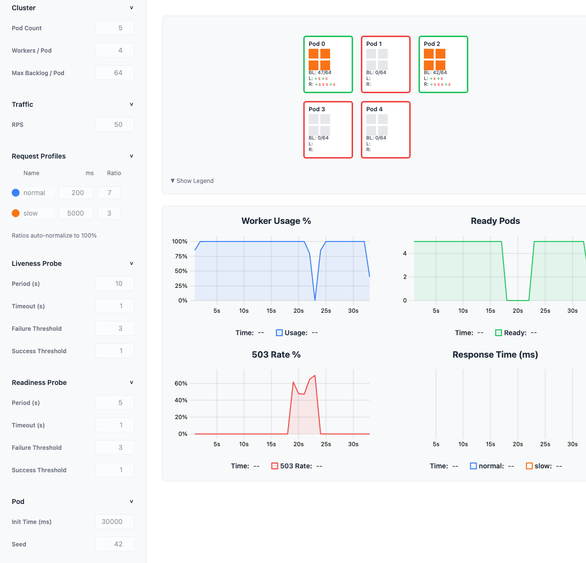
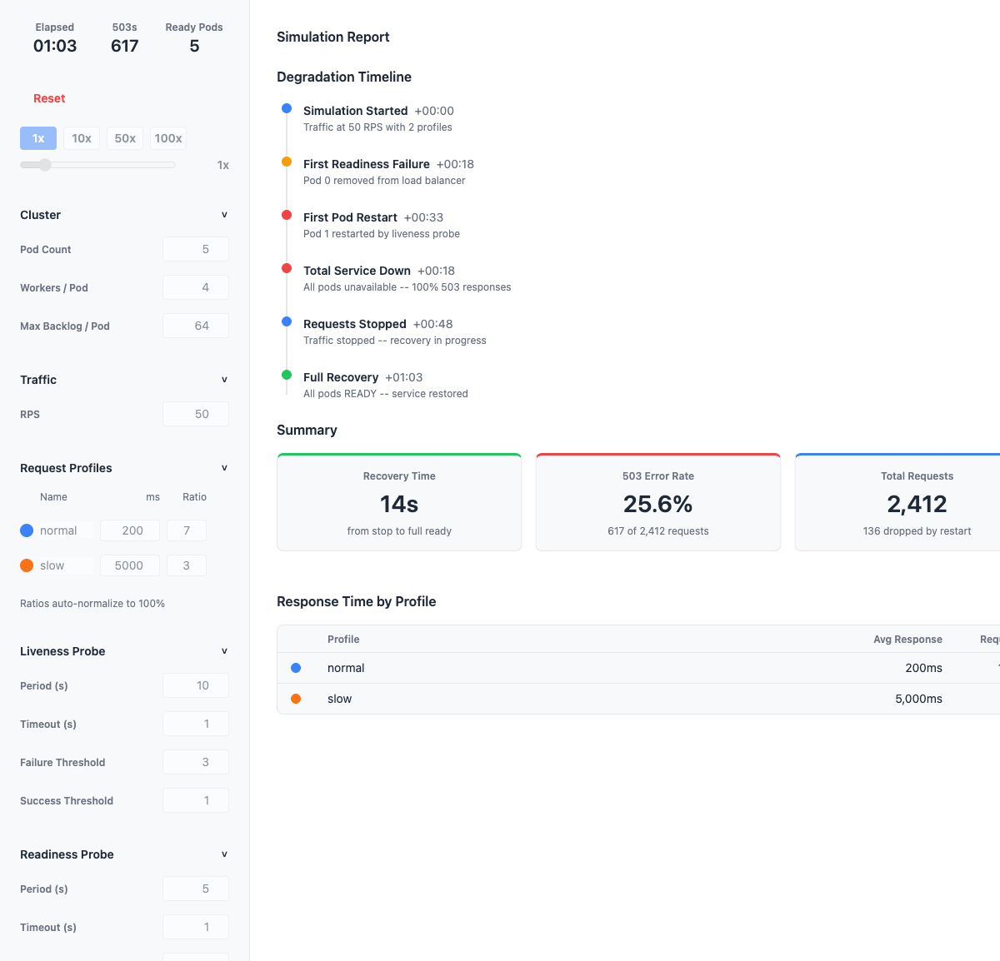

# Pod Resilience Simulator

EKS 환경에서 동기(synchronous) worker 기반 Pod들이 느린 요청에 의해 어떻게 무너지고 복구되는지를 시뮬레이션하는 브라우저 기반 도구.

> Pod/Worker 분배, backlog 크기, probe 설정에 따른 cascading failure 발생과 복구 과정을 시각적으로 확인하고, 서비스의 지연 저항성을 측정할 수 있다.

## Screenshots

| Configuration & Idle | Simulation Running |
|---|---|
|  |  |

| Cascading Failure | Post-Simulation Report |
|---|---|
|  |  |

## Why

gunicorn sync worker 같은 동기 서버에서 slow request는 worker를 점유하고, worker가 포화되면 health check probe도 응답을 못 받아 timeout되고, probe failure가 쌓이면 pod가 restart되면서 cascading failure가 발생한다.

이 시뮬레이터는 그 과정을 이산 이벤트 시뮬레이션(DES)으로 모델링하여, 파라미터 조합에 따른 서비스 내성 한계점을 빠르게 찾을 수 있게 한다.

## Features

- **Discrete Event Simulation** -- Pod state machine (READY/NOT_READY/RESTARTING), sync worker model, backlog queue, health check probes (liveness + readiness)
- **Real-time Visualization** -- Canvas 기반 Pod 상태 렌더링 + uPlot 시계열 차트 4종 (worker usage, ready pods, 503 rate, response time)
- **Full Parameter Control** -- 클러스터, 트래픽, probe, request profile 설정 + 0.5x~100x 배속 조절
- **Post-Simulation Report** -- 장애 타임라인, 복구 시간, 503 비율, profile별 응답시간

## Quick Start

```bash
git clone https://github.com/swhan9404/PodResilienceSimulator.git
cd PodResilienceSimulator
npm install
npm run dev
```

http://localhost:5173 에서 열기.

## Usage

1. 좌측 패널에서 파라미터 설정 (기본값으로도 동작)
2. **Start Simulation** 클릭
3. Pod가 degradation되는 과정을 Canvas + Chart로 관찰
4. **Stop Requests** 클릭하여 트래픽 중단 후 복구 과정 관찰
5. 모든 Pod가 복구되면 자동으로 **Simulation Report** 표시

### Key Parameters

| Parameter | Default | Description |
|-----------|---------|-------------|
| Pod Count | 5 | Pod 수 |
| Workers / Pod | 4 | Pod당 동기 worker 수 |
| Max Backlog / Pod | 10 | 대기열 최대 크기 |
| RPS | 50 | 초당 요청 수 |
| Request Profiles | normal(200ms, 70%), slow(5000ms, 30%) | 요청 유형별 처리시간과 비율 |

## Tech Stack

| Technology | Purpose |
|------------|---------|
| React 19 | UI framework |
| TypeScript | Type safety |
| Vite 8 | Build tool |
| Zustand 5 | State management |
| uPlot | Real-time time-series charts |
| Canvas 2D | Pod state visualization |
| Tailwind CSS 4 | Styling |
| Vitest | Testing (137 tests) |

## Project Structure

```
src/
  simulation/       # Headless DES engine (pure TypeScript, no UI dependency)
    engine.ts       #   SimulationEngine -- event loop, pod management
    pod.ts          #   Pod state machine (READY/NOT_READY/RESTARTING)
    load-balancer.ts#   Round-robin LB with strategy pattern
    metrics.ts      #   MetricsCollector
    types.ts        #   Core interfaces
  visualization/    # Rendering layer
    PodRenderer.ts  #   Canvas 2D pod grid renderer
    PodCanvas.tsx   #   React wrapper for Canvas
    MetricsChartManager.ts  # uPlot data transformation
    MetricsCharts.tsx       # 4 time-series charts
    SimulationLoop.ts       # RAF loop bridging engine to renderers
  store/            # Zustand state management
    useSimulationStore.ts   # Config, playback, chart data, report data
  components/       # React UI components
    ControlPanel.tsx        # Left sidebar container
    PlaybackControls.tsx    # Start/Pause/Resume/Reset/Stop
    SpeedControl.tsx        # 0.5x-100x speed slider
    SimulationReport.tsx    # Post-simulation report container
    DegradationTimeline.tsx # Vertical event timeline
    SummaryCards.tsx        # Recovery time, 503 rate, total requests
    ProfileTable.tsx        # Per-profile response time table
```

## Scripts

```bash
npm run dev        # Start dev server
npm run build      # Production build
npm run test       # Run tests
npm run test:watch # Watch mode
npm run lint       # ESLint
npm run preview    # Preview production build
```

## How It Works

1. **SimulationEngine** processes events from a priority queue (min-heap) in logical time
2. Request arrivals are distributed to READY pods via round-robin LB
3. Each pod has N sync workers -- when all workers are busy, requests queue in backlog
4. Liveness/readiness probes also consume worker slots (realistic gunicorn behavior)
5. Probe timeouts accumulate failures -- liveness kills the pod, readiness removes it from LB
6. When all pods are down, 100% of requests get 503
7. "Stop Requests" sets RPS to 0, allowing pods to drain and recover
8. Recovery is detected when all pods return to READY state

## License

MIT
